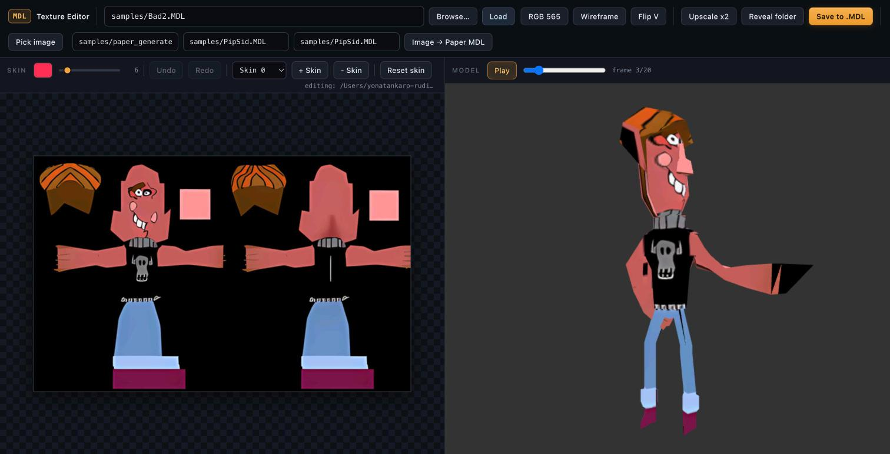

# MDL Texture Editor

[](https://github.com/yonatankarp/mdl-texture-editor/actions/workflows/ci.yml)

A local web tool for previewing and improving the textures of GameStudio A5 /
Quake-lineage `.MDL` models. The left pane is an editable view of the model's
skin; the right pane renders the textured 3D model in real time. Paint on the
skin in the browser, or edit it in your usual image editor, and the model
re-textures live so you can see how a change looks on the mesh as you make it.


It reads three model formats: **IDPO** (Quake1-style), **MDL5**, and **MDL3**
(both A5). MDL4 and MDL2 are not supported.

## Requirements

Python 3.9+ and the packages in `requirements.txt` (Flask and Pillow). The
native file picker (the Browse button) is macOS-only; on other platforms type
an absolute path into the field instead.

On Debian/Ubuntu, install the venv package first if `python3 -m venv` reports
that `ensurepip` is unavailable:

```bash
sudo apt install python3-venv
```

```bash
python3 -m venv .venv
source .venv/bin/activate
pip install -r requirements.txt
```

## Running

```bash
python server.py
```

Then open http://127.0.0.1:5005. It binds to localhost only and is meant as a
single-user tool, so it opens models anywhere on disk without a sandbox.

The field accepts either a path relative to this folder (for example
`samples/Paper2.MDL`) or an absolute path to any model on your machine. A few
sample models ship in `samples/`.

## Controls

`Browse` opens a native file dialog (macOS). `Load` loads the path in the field.

`565 preview` toggles a CPU RGB565 quantization of the skin, matching how the
A5 engine stores most textures, so you can preview the in-game color depth
instead of the full-color PNG.

`Wireframe` overlays the mesh edges.

`Play` + frame slider preview animation frames from the loaded model.

`Upscale x2` scales the extracted working skin in place so you can test higher
resolution texture edits directly on the mesh before saving back to `.MDL`.

`Image -> Paper MDL` generates a new flat/cutout IDPO model from an RGBA image
("Paper Mario"-style billboard workflow), writes it to the output path, and
loads it immediately for testing/editing.

The paper-generator row also accepts:
- a **height reference MDL** (for example `samples/PipSid.MDL`) so the
  generated cutout's maximum height matches that character scale.
- an **animation donor MDL** whose frame-to-frame motion is transferred as a
  simple transform timeline onto the generated cutout (best for first-pass
  replacement previews; not a full skeletal/vertex retarget).


`Flip V` inverts the model's vertical texture mapping and remembers the choice
per model (see below).

Use the skin selector in the left pane to switch between `skin0`, `skin1`, ...
for models that carry multiple skins. `+ Skin` duplicates the active skin as a
new slot, and `- Skin` removes the active slot (keeping at least one).

The paint toolbar above the left pane has a color picker, a brush-size slider,
and `Undo` / `Redo`. Undo/redo are also bound to `Ctrl/Cmd+Z` and `Ctrl/Cmd+Y`
(`Cmd+Shift+Z` works too).

## Recent additions in this branch

This repo now includes a broader authoring flow around the original texture
editor:

- **Animation preview in the viewer.** `/api/model` can return all frame
  positions (`includeFrames=1`), and the UI has play/scrub controls to inspect
  model motion directly in the editor.
- **Image-to-paper model generation.** The editor can build a flat cutout IDPO
  model from an RGBA image, then auto-load it for immediate preview.
- **Reference-size matching.** Paper generation can match the cutout's max
  height to a reference model (for example `samples/PipSid.MDL`) so replacement
  assets are authored at in-game character scale.
- **Donor animation transfer.** Paper generation can reuse a donor model's
  frame timeline as a simple transform-based animation track for first-pass
  replacement testing.
- **Visibility-safe 2D cutouts.** The generated flat model uses a
  character-facing plane and mirrored triangle winding so strict in-game
  backface culling does not hide the asset.
- **Multi-skin authoring.** You can browse, edit, add, and remove multiple
  skin slots in the UI; save re-embeds all current `skin*.png` slots and updates
  model skin count accordingly.
- **Upscaling workflow.** Working skins can be upscaled in place and
  re-previewed before writing back to `.MDL`.
- **Non-destructive save loop.** Edits are still rooted in `_backup_mdl/`, so
  repeated saves keep rebuilding from the pristine original model rather than
  compounding binary deltas.

## Orientation

The decoder flips texture V by default, which is correct for the large majority
of models (all standing figures). A minority of flat props (papers, vases,
coins) use the opposite vertical convention and load upside-down. Click
`Flip V` on those to correct them. The choice is saved per model in
`orientation.json` (keyed by absolute path), so you set it once and it sticks
the next time you open that model.

`orientation.json` holds only the exceptions and is git-ignored, since the
paths are specific to your machine.

## Editing a texture

You can edit two ways, and both feed the same live preview and save path.

**Paint in the browser.** Pick a color and brush size and paint directly on the
left pane; strokes appear on the 3D model as you draw. `Undo`/`Redo` (buttons or
`Ctrl/Cmd+Z` / `Ctrl/Cmd+Y`) step through your strokes.


**Edit in an external editor.** Loading a model automatically extracts its
skins to a working folder (`_edit/<model>/skin0.png` … `skinN.png`) and shows
that folder's path in the toolbar. `Reveal folder` opens it (macOS). Edit
`skin0.png` (or any `skinN.png`) in any image editor and save; the tool watches
the working skin and re-textures the model live. (Reloading a model reuses an
existing working skin, so it won't discard unsaved edits.)

When it looks right, click `Save to .MDL` to re-embed the edited skin into the
binary model. The first extract backs up the untouched original to
`_backup_mdl/<model>`, and every save rebuilds from that backup, so repeated
saves never compound and the original is always recoverable. Skins are
re-embedded as RGB565 (8-bit models are upgraded on save).

The `_edit/` and `_backup_mdl/` folders are git-ignored.

## Multi-skin models

Some models carry more than one skin: alternate textures the engine can swap
between (team colors, damage states, and so on). `Bad2.MDL` in `samples/`, for
example, has seven. The `Skin` selector above the left pane lists every skin in
the loaded model; pick one to view it on the 3D model and paint it. Switching
retargets both the paint canvas and the external-editor watcher, so each skin
edits independently. Models with a single skin show the selector disabled.

`+ Skin` duplicates the active skin as a new slot and `- Skin` removes the
active slot (always keeping at least one). Added and removed slots are reflected
the next time the model is reloaded, and `Save to .MDL` updates the model's skin
count to match.



Every skin is extracted to the working folder, and `Save to .MDL` re-embeds all
of them, so edits to any skin are written back together. Painted changes persist
per stroke, so switching skins never loses work; the undo history resets to the
newly selected skin.

## Layout

```
server.py          Flask backend: geometry, skin, orientation, extract/save, watch, file-pick
mdl_geometry.py    Pure-Python MDL geometry decoder (IDPO / MDL5 / MDL3)
mdl_tool.py        Skin decode/encode + extract/import CLI (8-bit and 565)
game_palette.raw   256-color palette for 8-bit skins
static/            Three.js viewer (index.html, app.js, vendored three.js)
samples/           A few small models for a first run and for the tests
tests/             pytest suite for the decoder and the server
```

## Tests

```bash
python3 -m pytest
```

## Origin

Extracted from the Piposh 3D Remaster project as a reusable, self-contained
tool. `mdl_tool.py` and `game_palette.raw` are vendored from that project so
this repo has no external dependency on it.
